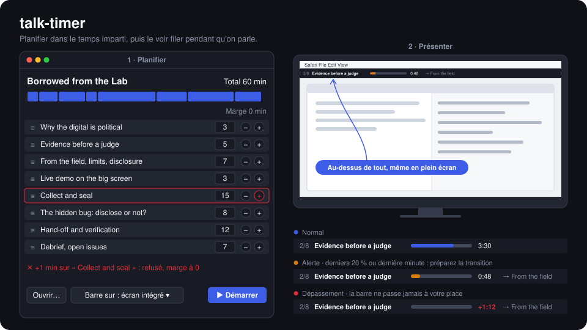

# talk-timer

](#)
[](#)
[](LICENSE)

[](https://github.com/caffe-doppio/talk-timer/actions/workflows/ci.yml)

[English](README.md) · **Français**

Un planificateur de discours avec une barre de temps flottante, pour macOS.

Pour qui a un plan solide mais perd le fil du temps en parlant : un sous-sujet passionnant prévu pour 5 minutes en prend 15, et c'est pire en langue étrangère.



1. **Planifier.** On fixe une durée totale, puis on range, allonge ou raccourcit des blocs. Le total ne peut jamais être dépassé : allonger un bloc consomme la marge, et quand la marge est vide, il faut raccourcir ailleurs.
2. **Tenir le temps.** Pendant la présentation, une barre fine en haut de l'écran, au-dessus de toutes les applis, affiche la séquence en cours et une jauge qui se vide. On voit la fin arriver et on a le temps de préparer sa transition.

L'outil ne coupe jamais la parole : c'est la personne qui décide quand passer au bloc suivant.

> [!NOTE]
> **Statut : spike de la barre.** La barre flottante fonctionne à partir d'un fichier de talk. La fenêtre du planificateur n'est pas encore faite.
> Spécifications complètes : [`SPECS.md`](SPECS.md).

## Prérequis

- macOS 26 (Tahoe)
- Xcode 26 ou les Command Line Tools, Swift 6.2 ou plus récent

## Utilisation

```bash
swift build          # compiler
swift test           # lancer les tests
open Package.swift   # ouvrir dans Xcode

# Spike de la barre : affiche la barre d'un talk sur l'écran N (0 par défaut, celui de la barre de menus)
swift run TalkTimer fixtures/borrowed-from-the-lab.json --screen 1
```

Au lancement, l'appli affiche dans le terminal la liste des écrans et leurs numéros.

> [!IMPORTANT]
> Pour présenter, mettez les écrans en **mode étendu**, pas en recopie, et affichez la barre sur l'écran du portable. En recopie, le public voit la barre.

## Format d'un talk

Un talk est un fichier JSON, écrit à la main ou par le planificateur :

```json
{
  "title": "Borrowed from the Lab",
  "totalMinutes": 60,
  "blocks": [
    { "title": "Why the digital is political", "minutes": 3 },
    { "title": "Live demo on the big screen", "minutes": 3, "cue": "Enough talk: let me show it once." }
  ]
}
```

- La marge, `totalMinutes − Σ minutes`, est calculée et jamais stockée.
- `cue` est une phrase de transition facultative, affichée quand la fin du bloc approche.
- Un fichier dont la somme des blocs dépasse le total est refusé au chargement.

Exemple complet : [`fixtures/borrowed-from-the-lab.json`](fixtures/borrowed-from-the-lab.json), la timeline d'un workshop de 60 minutes en 8 blocs.

## La barre

| État | Quand | Ce qu'elle montre |
|---|---|---|
| Normal | Plus de 20 % du bloc restant, et plus d'une minute | Jauge bleue, compte à rebours |
| Alerte | 20 % du bloc ou dernière minute, selon ce qui arrive en premier | Jauge orange, bloc suivant et phrase de transition |
| Dépassement | Au-delà de zéro | Jauge vide, `+m:ss` rouge qui monte |

| Raccourci | Action |
|---|---|
| ⌃⌥→ ou clic sur la barre | Bloc suivant |
| ⌃⌥← | Revenir au bloc précédent |
| ⌃⌥Espace | Pause / reprise (pas encore dans le spike) |

Les raccourcis sont globaux : ils fonctionnent même quand une autre appli a le focus, et ne demandent pas l'autorisation Accessibilité.

## Structure

```
Package.swift
Sources/TalkTimer/Model.swift          format de fichier, règles de marge, horloge de session, états de la barre
Sources/TalkTimer/Bar.swift            panneau flottant, vue de la barre, raccourcis globaux
Sources/TalkTimer/App.swift            point d'entrée
Tests/TalkTimerTests/ModelTests.swift  critères d'acceptation (SPECS.md § 10)
fixtures/                              talks de référence pour les tests
docs/sketch.py                         génère docs/sketch-{en,fr}.svg
```

La CI lance SwiftLint (`.swiftlint.yml`, adapté de [exelban/stats](https://github.com/exelban/stats)) sous Linux, puis la compilation et les tests sous macOS 26.

## Vie privée

Aucun accès réseau, aucune télémétrie. Les talks restent des fichiers locaux.

## Licence

Copyright 2026 Sasha. Publié sous licence [Apache 2.0](LICENSE).
