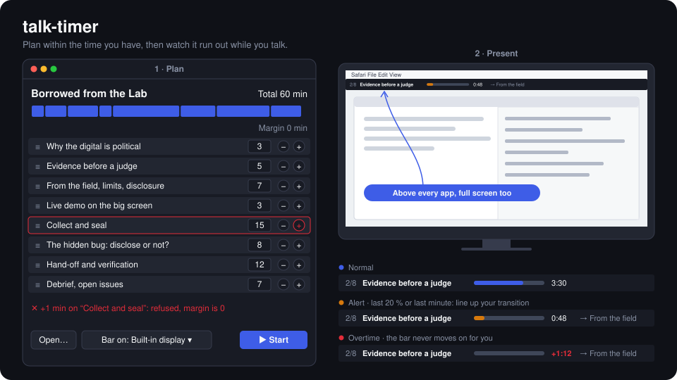

# talk-timer

[](#)
[](#)
[](LICENSE)

[](https://github.com/caffe-doppio/talk-timer/actions/workflows/ci.yml)

**English** · [Français](README.fr.md)

A talk planner with a floating time bar, for macOS.

For people who have a solid outline but lose track of time once they start talking. A fascinating sub-topic planned for 5 minutes takes 15, and it gets worse in a foreign language.



1. **Plan.** Set the total length, then reorder, extend or shorten blocks. The total can never be exceeded: extending a block uses up the margin, and once the margin is empty you have to shorten something else.
2. **Keep time.** While you present, a thin bar at the top of the screen, above every app, shows the current section and a gauge that runs out. You see the end coming and have time to find your transition.

The tool never cuts you off: you decide when to move to the next block.

> [!NOTE]
> **Status: bar spike.** The floating bar runs from a talk file. The planner window is not built yet.
> Full specification (French): [`SPECS.md`](SPECS.md).

## Requirements

- macOS 26 (Tahoe)
- Xcode 26 or the Command Line Tools, Swift 6.2 or later

## Usage

```bash
swift build          # build
swift test           # run the tests
open Package.swift   # open in Xcode

# Bar spike: shows the bar for a talk, on screen N (default 0, the one with the menu bar)
swift run TalkTimer fixtures/borrowed-from-the-lab.json --screen 1
```

On launch, the app lists the available screens and their numbers in the terminal.

> [!IMPORTANT]
> To present, set your displays to **extended**, not mirrored, and put the bar on the laptop screen. When mirrored, the audience sees the bar.

## Talk file format

A talk is a JSON file, written by hand or by the planner:

```json
{
  "title": "Borrowed from the Lab",
  "totalMinutes": 60,
  "blocks": [
    { "title": "Why the digital is political", "minutes": 3 },
    { "title": "Live demo on the big screen", "minutes": 3, "cue": "Enough talk: let me show it once." }
  ]
}
```

- The margin, `totalMinutes − Σ minutes`, is computed and never stored.
- `cue` is an optional transition line, shown when the end of the block gets close.
- A file whose blocks add up to more than the total is refused on load.

Full example: [`fixtures/borrowed-from-the-lab.json`](fixtures/borrowed-from-the-lab.json), the timeline of a 60-minute workshop in 8 blocks.

## The bar

| State | When | What it shows |
|---|---|---|
| Normal | More than 20 % of the block left, and more than 1 minute | Blue gauge, countdown |
| Alert | 20 % of the block or the last minute, whichever comes first | Orange gauge, next block and transition line |
| Overtime | Past zero | Empty gauge, red `+m:ss` counting up |

| Shortcut | Action |
|---|---|
| ⌃⌥→ or click on the bar | Next block |
| ⌃⌥← | Back to the previous block |
| ⌃⌥Space | Pause / resume (not in the spike yet) |

Shortcuts are global: they work while another app has focus, and do not need the Accessibility permission.

## Layout

```
Package.swift
Sources/TalkTimer/Model.swift          file format, margin rules, session clock, bar states
Sources/TalkTimer/Bar.swift            floating panel, bar view, global shortcuts
Sources/TalkTimer/App.swift            entry point
Tests/TalkTimerTests/ModelTests.swift  acceptance criteria (SPECS.md § 10)
fixtures/                              reference talks for the tests
docs/sketch.py                         generates docs/sketch-{en,fr}.svg
```

CI runs SwiftLint (`.swiftlint.yml`, adapted from [exelban/stats](https://github.com/exelban/stats)) on Linux, then build and tests on macOS 26.

## Privacy

No network access, no telemetry. Talks stay as local files.

## License

Copyright 2026 Sasha. Released under the [Apache 2.0](LICENSE) license.
